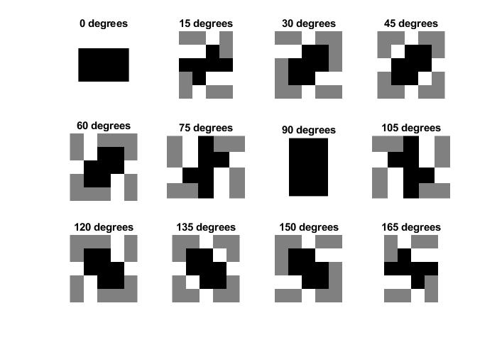
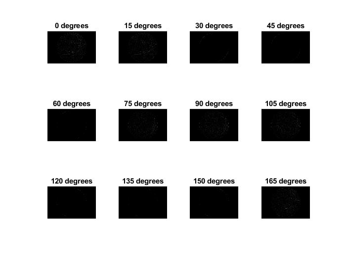
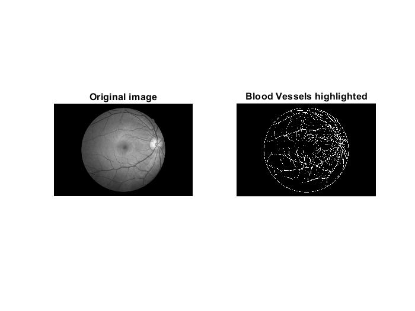

# Blood-Vessel-Detection-Using-Matched-Filters
This project aims to reproduce the algorithm presented in the research paper of IEEE 1989, Blood Vessel Detection in Retinal Images using 2D Matched Filters. I have implemented the concepts brought through in MATLAB 2019 with the help of Toolbox functions.

Here is a link to the paper: https://ieeexplore.ieee.org/document/34715

## Summary of the Paper
This paper uses the concept of matched filters to detect piece-wise linear segments of blood vessels in retinal images. The filters are so produced by assuming that the distribution of pixel intensities across a blood vessel normally is best represented by a Gaussian distribution.

#### Pre-processing
Image is first converted to grayscale, and an average smoothing filter of window 5x5 is applied to suppress high frequency noise. 

#### Algorithm
Kernels are generated by taking in the sigma of the Gaussian and the length of the filter. The angular resolution is kept to 15 degrees, which means 12 filters are generated to span 180 degrees. These kernels are in turn applied on the pre-processed image. The max value of each pixel amongst the 12 images (above a certain threshold) contributes to the final image.

For the image used in the documentation here, a sigma=0.5 and length L=3 was used, with a threshold of 20.

#### Post-processing
A sort of 'salt and pepper' noise was seen between vessels, and so a median filter was applied to reduce them. 

## My Results

The kernels used are shown below in a grayscale format. There are 12 kernels used to span 180 degrees.

These kernels are applied on the pre-processed image, and the results for that are shown below. Continuous white lines are difficult to see, since these are orientation filtered. For the original image, please see the Images/Results folder in this repository. 

Here is a comparison of the original image and the final output image with blood vessels highlighted.

## My Conclusions
This algorithm works very well in detecting blood vessels in retinal images if an estimate of the general width of the blood vessels is known. The result is very sensitive to the value of sigma chosen for the Gaussian distribution. 

I would like to work on making the kernel more adaptive to the blood vessel width, as I found that where the blood vessels trailed off (ie became thinner), there were less chances of it being detected.

It is also a challenge to remove the optic disc in the identification. 
